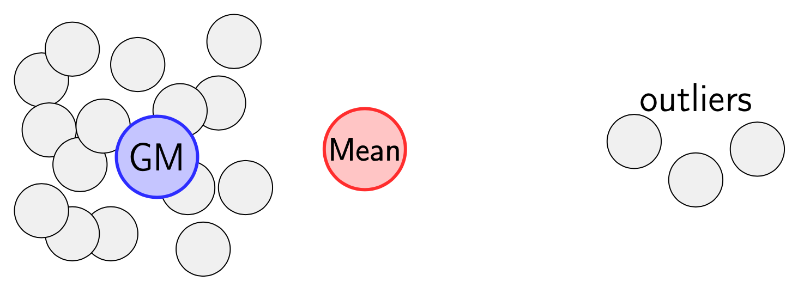

# Differentiable and Fast Geometric Median in NumPy and PyTorch

This package implements a fast numerical algorithm to compute the geometric median of high dimensional vectors.
As a generalization of the median (of scalars), the [geometric median](https://en.wikipedia.org/wiki/Geometric_median) 
is a robust estimator of the mean in the presence of outliers and contaminations (adversarial or otherwise). 



It is defined as the minimizer of the convex optimization problem as follows.


The geometric median is also known as the Fermat point, Weber's L1 median, Fréchet median among others. 
It has a breakdown point of 0.5, meaning that it yields a robust aggregate even under arbitrary corruptions to points accounting for under half the total weight. We use the smoothed Weiszfeld algorithm to compute the geometric median. 

**Features**:
- Implementation in both NumPy and PyTorch.
- PyTorch implementation is fully differentiable (compatible with gradient backpropagation a.k.a. automatic differentiation) and can run on GPUs with CUDA tensors.
- Blazing fast algorithm that converges linearly in almost all practical settings. 

# Installation
This package can be installed via pip as `pip install geom_median`. Alternatively, for an editable install, 
run
```bash
git clone git@github.com:krishnap25/geom_median.git
cd geom_median
pip install -e .
```

You must have a working installation of PyTorch, version 1.7 or over in case you wish to use the PyTorch API. 
See details [here](https://pytorch.org/get-started/locally/).

# Usage Guide
We describe the PyTorch usage here. The NumPy API is entirely analogous. 

```python
import torch
from geom_median.torch import compute_geometric_median   # PyTorch API
# from geom_median.numpy import compute_geometric_median  # NumPy API
```

For the simplest use case, supply a list of tensors: 

```python
n = 10  # Number of vectors
d = 25  # dimensionality of each vector
points = [torch.rand(d) for _ in range(n)]   # list of n tensors of shape (d,)
# The shape of each tensor is the same and can be arbitrary (not necessarily 1-dimensional)
weights = torch.rand(n)  # non-negative weights of shape (n,)
out = compute_geometric_median(points, weights)
# Access the median via `out.median`, which has the same shape as the points, i.e., (d,)
```
The termination condition can be examined through `out.termination`, which gives a message such as 
`"function value converged within tolerance"` or `"maximum iterations reached"`.

We also support a use case where each point is given by list of tensors. 
For instance, each point is the list of parameters of a `torch.nn.Module` for instance as `point = list(module.parameters())`.
In this case, this is equivalent to flattening and concatenating all the tensors into a single vector via 
`flatted_point = torch.stack([v.view(-1) for v in point])`.
This functionality can be invoked as follows: 

```python
models = [torch.nn.Linear(20, 10) for _ in range(n)]  # a list of n models
points = [list(model.parameters()) for model in models]  # list of points, where each point is a list of tensors
out = compute_geometric_median(points, weights=None)  # equivalent to `weights = torch.ones(n)`. 
# Access the median via `out.median`, also given as a list of tensors
```

We also support computing the geometric median for each component separately in the list-of-tensors format:
```python
models = [torch.nn.Linear(20, 10) for _ in range(n)]  # a list of n models
points = [list(model.parameters()) for model in models]  # list of points, where each point is a list of tensors
out = compute_geometric_median(points, weights=None, per_component=True)  
# Access the median via `out.median`, also given as a list of tensors
```
This per-component geometric median is equivalent in functionality to 
```python
out.median[j] = compute_geometric_median([p[j] for p in points], weights)
```

## Backpropagation support
When using the PyTorch API, the result `out.median`, as a function of `points`, supports gradient backpropagation, also known as reverse-mode automatic differentiation. Here is a toy example illustrating this behavior.
```python
points = [torch.rand(d).requires_grad_(True) for _ in range(n)]   # list of tensors with `requires_grad=True`
out = compute_geometric_median(points, weights=None)
torch.linalg.norm(out.median).backward()  # call backward on any downstream function of `out.median`
gradients = [p.grad for p in points]  # gradients with respect of `points` and upstream nodes in the computation graph
```

## GPU support
Simply use as above where `points` and `weights` are CUDA tensors. 

# Authors and Contact
[Krishna Pillutla](https://krishnap25.github.io/)   
[Sham Kakade](https://sham.seas.harvard.edu/)   
[Zaid Harchaoui](https://faculty.washington.edu/zaid/)

In case of questions, please raise an issue on GitHub. 

# Citation
If you found this package useful, please consider citing this paper. 

```
@article{pillutla:etal:rfa ,
  title={{Robust Aggregation for Federated Learning}},
  author={Pillutla, Krishna and  Kakade, Sham M. and Harchaoui, Zaid},
  journal={arXiv preprint},
  year={2019}
}
```
